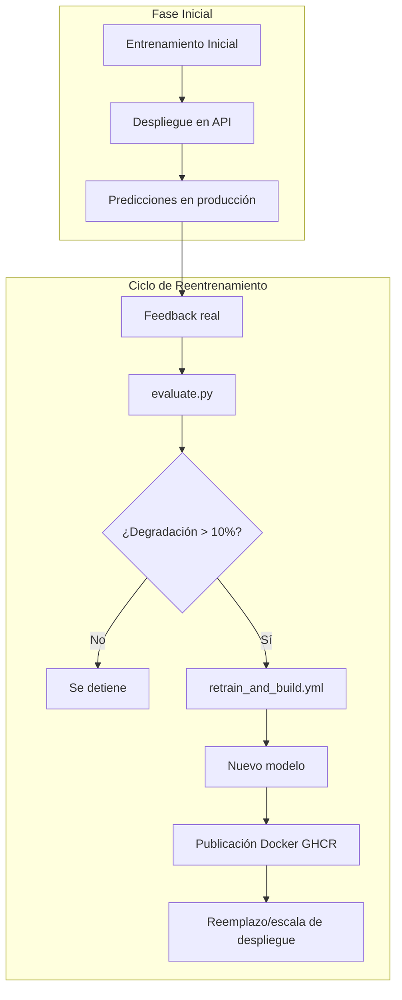

# MLOps Housing Price Predictor – Pipeline Completo con CI/CD, Docker y Reentrenamiento Automático


Este proyecto implementa un flujo completo de MLOps aplicado a un modelo de predicción de precios de viviendas (dataset Housing/Boston como referencia académica). El enfoque está diseñado para simular condiciones reales de producción, incorporando entrenamiento reproducible, despliegue vía API, monitoreo, recolección de feedback, evaluación periódica del rendimiento, reentrenamiento condicionado y republicación automatizada del modelo como imagen Docker inmutable mediante pipelines CI/CD en GitHub Actions.


---


## 1. Objetivo del proyecto


Demostrar un ciclo de vida MLOps completo:


1. Entrenar un modelo inicial.

2. Servirlo mediante una API REST.

3. Capturar predicciones y feedback del usuario.

4. Monitorear periódicamente el rendimiento del modelo.

5. Detectar posibles degradaciones.

6. Ejecutar automáticamente un proceso de reentrenamiento.

7. Construir y publicar una nueva versión del modelo como contenedor Docker de producción.

8. Mantener versionado y trazabilidad en todo el proceso.


---


## 2. Arquitectura MLOps implementada


El flujo implementado sigue el siguiente ciclo:




## 2.1. Stack Tecnológico Principal

El proyecto está construido sobre un conjunto de librerías modernas y robustas de Python para machine learning y desarrollo de APIs. Las más destacadas son:

* **Servidor API**: `FastAPI` para construir una API REST de alto rendimiento.
* **Validación de Datos**: `Pydantic` para la validación y serialización de los datos de entrada/salida de la API.
* **Machine Learning**: `Scikit-learn` para la construcción del pipeline de entrenamiento y el modelo (`RandomForestRegressor`).
* **Manipulación de Datos**: `Pandas` para la carga y manipulación eficiente de los datos.
* **Monitoreo**: `Prometheus Client` para la exposición de métricas clave de la API.


---


## 3. Explicación del pipeline interno (`mlops_housing`)


El código fuente sigue prácticas modulares dentro del paquete `mlops_housing`:


| Archivo | Rol |
|---------|-----|
| `pipeline.py` | Define el pipeline de machine learning (preprocesamiento + modelo RandomForest). |
| `train.py` | Entrena el modelo con un dataset dado y registra sus métricas. |
| `registry.py` | Maneja la lectura/escritura de versiones del modelo (gestión en `artifacts/`). |
| `api/app.py` | Implementa la API con FastAPI para predicción, feedback, versión y salud. |
| `schemas.py` | Estructura y valida las features de entrada usando Pydantic. |
| `evaluate.py` | Evalúa la calidad del modelo usando los registros recientes de predicción/feedback. |


---


## 4. Flujo completo de uso en producción


1. El modelo se entrena con `train.py` y se almacena bajo `artifacts/`.

2. Se construye una imagen Docker que contiene el modelo.

3. La API se despliega para uso.

4. Predicciones se almacenan en `logs/predictions.csv`.

5. Los usuarios envían valores reales vía `/feedback`.

6. `evaluate.py` analiza métricas basadas en datos recientes.

7. Si se detecta degradación (>10% peor que baseline), se activa reentrenamiento.

8. GitHub Actions ejecuta `retrain_and_build.yml`, genera un nuevo modelo.

9. La nueva imagen se publica en GHCR.


---


## 5. Estructura del proyecto


### Árbol de Directorios

```text
MELI-challenge/
├── .github/workflows/
│   ├── pipeline.yml
│   ├── evaluate.yml
│   └── retrain_and_build.yml
├── artifacts/
├── data/
├── logs/
├── src/mlops_housing/
│   ├── api/
│   │   └── app.py
│   ├── __init__.py
│   ├── evaluate.py
│   ├── pipeline.py
│   ├── registry.py
│   ├── schemas.py
│   └── train.py
├── Dockerfile
└── requirements.txt
```

### Análisis Exploratorio de Datos (EDA)

Adicionalmente al código de producción, el repositorio incluye un Jupyter Notebook con el análisis exploratorio de datos (EDA) inicial.

* **Ubicación**: `notebook/data_exploration.ipynb`
* **Propósito**: Este notebook contiene la carga inicial de datos, visualizaciones, análisis de correlaciones y las primeras hipótesis que guiaron el diseño del pipeline de machine learning.

> **Nota**: El contenido de este notebook tiene fines de investigación y contextualización. No es necesario ejecutarlo para entrenar o desplegar el modelo, ya que el pipeline de producción (`mlops_housing/pipeline.py`) encapsula todos los pasos de preprocesamiento requeridos.

---


## 6. Instalación local


Esta sección describe los pasos para configurar el entorno virtual de Python e instalar las dependencias del proyecto.

## Comandos de Instalación

```bash
python -m venv venv
source venv/bin/activate
pip install --upgrade pip
pip install -r requirements.txt
pip install -e .
```


---


## 7. Entrenamiento manual local


Este comando ejecuta el script de entrenamiento del modelo, pasándole los parámetros necesarios para localizar los datos y etiquetar la ejecución.

### Comando de Ejemplo

```bash
python -m mlops_housing.train --data_path data/HousingData.csv --tag primera_version
```


---


## 8. Ejecución de pruebas unitarias (opcional)


Este comando utiliza la librería `pytest` para descubrir y ejecutar automáticamente las pruebas unitarias del proyecto, asegurando que todos los componentes funcionen correctamente.

### Comando Principal

```bash
pytest -v
```


---


## 9. Arranque de la API en local


### Comando Principal

```bash
uvicorn mlops_housing.api.app:app --reload --port 8000
```


Rutas principales:

| Endpoint | Método | Descripción |
|----------|--------|-------------|
| /predict | POST | Genera una predicción. |
| /feedback | POST | Envía el valor real posterior a una predicción. |
| /version | GET | Informa versión actual del modelo. |
| /metrics | GET | Compatible para Prometheus. |
| /healthz | GET | Confirma estado de servicio. |


El endpoint `/predict` espera una petición `POST` que contenga un cuerpo en formato JSON con las 13 características (features) que el modelo necesita para realizar una predicción. Estas características corresponden a diferentes atributos de una vivienda, como la tasa de criminalidad, la cantidad de habitaciones, la distancia a centros de empleo, entre otros.

### Ejemplo de JSON válido

```json
{
    "CRIM": 0.1,
    "ZN": 18.0,
    "INDUS": 2.31,
    "CHAS": 0,
    "NOX": 0.538,
    "RM": 6.575,
    "AGE": 65.2,
    "DIS": 4.09,
    "RAD": 1,
    "TAX": 296,
    "PTRATIO": 15.3,
    "B": 396.9,
    "LSTAT": 4.98
}
```


El endpoint `/feedback` permite registrar el valor real (ground truth) asociado a una predicción que fue realizada previamente. Este proceso es fundamental para monitorear el rendimiento del modelo a lo largo del tiempo y detectar si su precisión se está degradando.

### Ejemplo de JSON válido

```json
{
    "prediction_id": "175e49cf-e773-4625-ae36-9220b6ff1215",
    "real_price": 23.4
}
```


### Ejemplos de Uso con CURL

A continuación se muestran ejemplos prácticos de cómo interactuar con los endpoints de la API utilizando la herramienta de línea de comandos `CURL`.

---

### Realizar una Predicción (`/predict`)

Este comando envía una petición `POST` al endpoint `/predict` con las 13 características de una vivienda para obtener una predicción de su precio.

### Comando

```bash
curl -X 'POST' \
  'http://localhost:8000/predict' \
  -H 'Content-Type: application/json' \
  -d '{
    "CRIM": 0.027, "ZN": 0, "INDUS": 7.07, "CHAS": 0, "NOX": 0.469,
    "RM": 6.421, "AGE": 78.9, "DIS": 4.96, "RAD": 2, "TAX": 242,
    "PTRATIO": 17.8, "B": 396.9, "LSTAT": 9.14
  }'
```

### Respuesta Esperada

La API devolverá un objeto JSON con el precio predicho y un `id` único que puede ser usado posteriormente para enviar feedback.

```json
{
  "predicted_price": 21.6,
  "id": "175e49cf-e773-4625-ae36-9220b6ff1215"
}
```

### Enviar Feedback (`/feedback`)

Este comando envía el precio real de una vivienda que fue objeto de una predicción anterior. Se utiliza el `id` devuelto por el endpoint `/predict` para asociar el valor real con la predicción correspondiente.

```bash
curl -X 'POST' \
  'http://localhost:8000/feedback' \
  -H 'Content-Type: application/json' \
  -d '{
    "id": "175e49cf-e773-4625-ae36-9220b6ff1215",
    "real_price": 24.5
  }'
```


*Nota: Se asume que una predicción anterior devolvió el ID "175e49cf-e773-4625-ae36-9220b6ff1215".*

Se responderá con un mensaje de confirmación indicando que el feedback ha sido registrado correctamente.

```json
{
  "message": "Valor real actualizado correctamente"
}
```


## 10. Uso con Docker


### Construcción de imagen


```bash
docker build -t housing-api:latest –target runtime .
```


### Ejecución en modo producción con persistencia:

Ejecutando el contenedor Docker, exponiendo el puerto 8000 y montando un volumen local para persistir los logs de predicciones y feedback. Así podremos reevaluar el modelo en el futuro y saber si ha habido degradación.

```bash
docker run --rm -p 8000:8000 -v ./logs:/app/logs housing-api:latest
```


---


## 11. CI/CD en GitHub Actions


### `pipeline.yml`:

- Ejecuta tests.

- Construye la imagen Docker para validar integridad.


### `evaluate.yml`:

- Se activa manualmente o por cron.

- Ejecuta `python -m mlops_housing.evaluate`.

- Si el script retorna `exit code 2` (degradación detectada), dispara `retrain_and_build.yml`.


### `retrain_and_build.yml`:

- Reentrena el modelo.

- Genera nuevos artifacts.

- Reconstruye imagen Docker con el nuevo modelo.

- Publica en GHCR.

```mermaid
graph TD
    subgraph "CI Pipeline"
        A(pipeline.yml)
        A -- "Ejecuta tests" --> A1[Tests OK?]
        A1 -- "Construye imagen" --> A2(Imagen Docker)
    end

    subgraph "Monitoreo y Evaluación"
        B(evaluate.yml)
        B -- "Manualmente o por Cron" --> B1("python -m mlops_housing.evaluate")
        B1 -- "Analiza rendimiento" --> B2{"Degradacion? (exit code 2)"}
    end

    subgraph "CD Pipeline"
        C(retrain_and_build.yml)
        C -- "Reentrena modelo" --> C1[Nuevos artifacts]
        C1 -- "Reconstruye imagen" --> C2[Nueva imagen Docker]
        C2 -- "Publica imagen" --> C3(Publicado en GHCR)
    end

    B2 -- Sí --> C
    B2 -- No --> D[Proceso finalizado]

---


## 12. Mejores prácticas futuras y roadmap

| Mejora | Razón |
|-------------------------------------------|----------------------------------------------------------|
| Almacenamiento de feedback en S3/BigQuery | Para análisis y reentrenamiento con datos reales. |
| Feature Store (Feast) | Versionado consistente de features. |
| Orquestación con Airflow o Prefect | Creación de DAG completo (entrenar → publicar → evaluar). |
| Canary Deploy | Validación controlada en Kubernetes. |
| Prometheus + Grafana | Métricas y alertas en tiempo real. |
| DVC para datos | Versionado de datasets. |

---

## 13. Uso de Inteligencia Artificial en el desarrollo

| Herramienta | Rol |
|--------------|-------------------------------------------------------------------------------------------|
| GitHub Copilot | Ayuda en autocompletado y generación parcial de código. |
| Gemini | Evaluación y recomendaciones sobre la estructura del repositorio. |
| ChatGPT | Diseño asistido del pipeline CI/CD, construcción de workflows YAML, debugging de evaluate y revisor readme|


